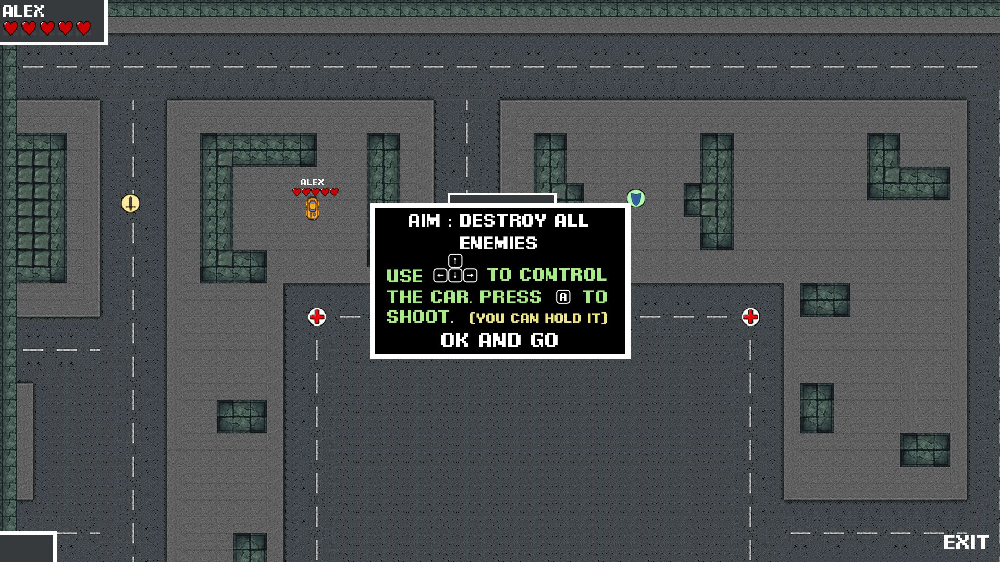
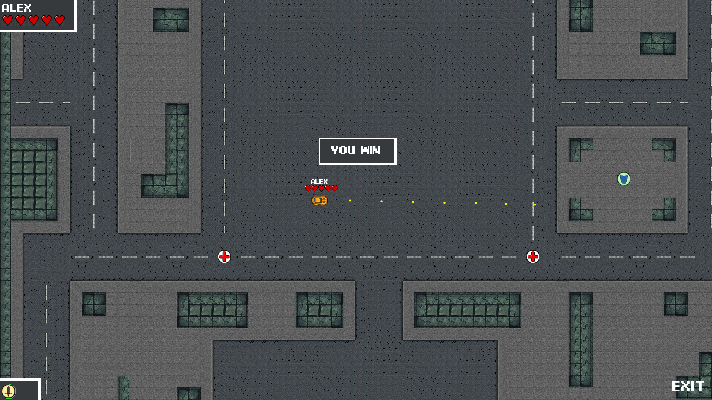

# CarBattle
This is a fighting local multiplayer game written in Python and powered by [Pygame](http://www.pygame.org).


## Necessary things
### Python
[Python 3](https://www.python.org/downloads/) installed on your machine.
You need to have a LAN network, good connection.

### Install Pygame
Instal pygame.
```
$ pip install pygame
```
### Launch
```
$ python carbattle.py
```

### Game process




For the local multiplayer process the idea of room is used. First, create a room. Then ask your friends (up to 3) to connect to your room (they must enter ), and then start. 

The main aim is to destroy all other cars. You can gather bonuses, such as Sword (temporary shooting faster), Shield (temporary immunity), Medkit (+1 heart of health, if not full).
Use arrows to control your car.



Have fun!
